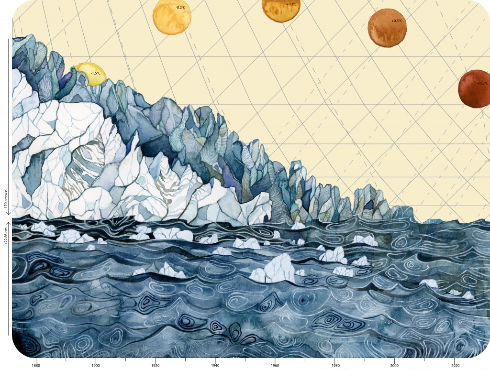

---
title:
author: "cjlortie, afilazzola, & butterfield"
date: "August 2017"
output:
  html_document:
    theme: yeti
    toc: yes
    toc_depth: 3
    toc_float: yes
  pdf_document:
    toc: yes
---
   

##Alpine niche, climate, & rii exploration
 

 

###Hypothesis
Niche breadth for beneficiary species facilitated by cushion plants will be greater than other non-foundation associated species, and climate is an important mediator.

